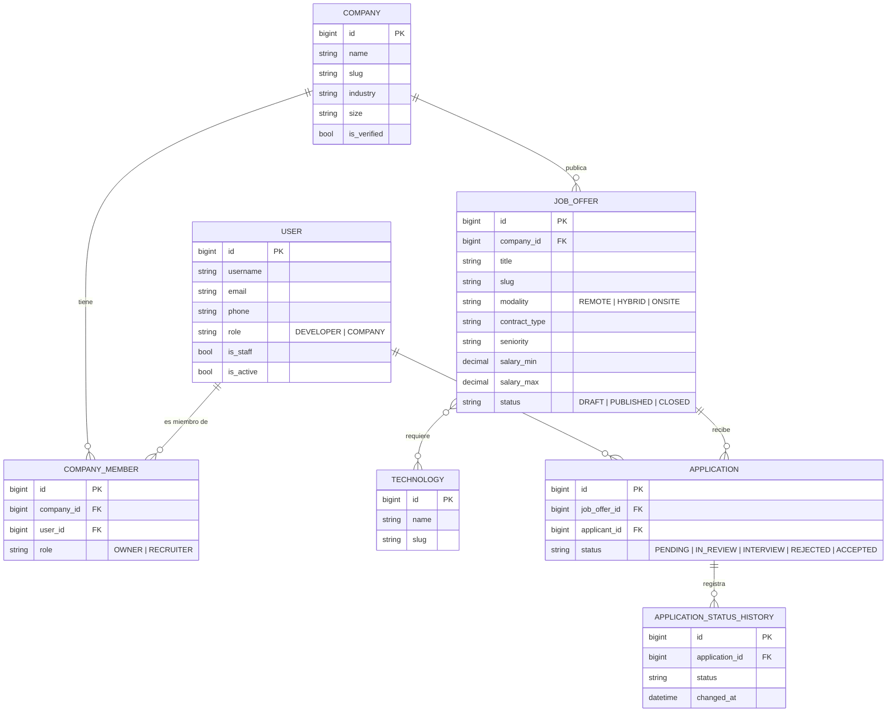

# DevJob

Plataforma de empleo especializada para desarrolladores.

## Tecnologías

- Python
- Django
- Django REST Framework
- PostgreSQL
- Git
- GitHub

## Arquitectura de aplicaciones

El proyecto se divide en apps de Django, cada una responsable de un dominio del negocio. La configuración global vive en `config/`.

| App | Responsabilidad | Ruta base |
|-----|-----------------|-----------|
| `core` | Funcionalidad transversal compartida por el resto de apps: utilidades, modelos base abstractos y endpoints de sistema (p. ej. health check). No contiene lógica de negocio. | `/` |
| `users` | Gestión de usuarios: registro, autenticación, perfiles de desarrolladores y roles. | `/api/users/` |
| `companies` | Empresas que publican ofertas: perfil de empresa, datos de contacto y miembros reclutadores. | `/api/companies/` |
| `jobs` | Ofertas de empleo: creación, edición, publicación, búsqueda y filtrado (tecnologías, modalidad, salario, etc.). | `/api/jobs/` |
| `applications` | Postulaciones de desarrolladores a ofertas: envío, seguimiento y cambios de estado del proceso de selección. | `/api/applications/` |

### Dependencias entre dominios

- `core` no depende de ninguna otra app.
- `users` y `companies` pueden depender de `core`.
- `jobs` depende de `companies` (cada oferta pertenece a una empresa).
- `applications` depende de `users` y `jobs` (un usuario se postula a una oferta).

### Estructura de cada app

Todas las apps siguen la misma estructura:

```
<app>/
├── migrations/
├── __init__.py
├── admin.py      # Registro de modelos en el admin
├── apps.py       # Configuración de la app
├── models.py     # Modelos del dominio
├── tests.py      # Pruebas
├── urls.py       # Rutas de la app (incluidas en config/urls.py)
└── views.py      # Vistas / endpoints
```

## Esquema de base de datos

Cada app define sus propios modelos. `core` solo aporta `TimeStampedModel`, una clase
abstracta con `created_at`/`updated_at` que heredan los modelos de negocio.



| Modelo | App | Resumen |
|--------|-----|---------|
| `User` | `users` | Usuario de autenticación (`AUTH_USER_MODEL`). `role` distingue developer/company. |
| `Company` | `companies` | Perfil de empresa. Relacionada con `User` vía `members` (M2M a través de `CompanyMember`). |
| `CompanyMember` | `companies` | Tabla intermedia: qué usuarios pertenecen a qué empresa y con qué rol (`OWNER`/`RECRUITER`). |
| `Technology` | `jobs` | Catálogo de tecnologías/skills, reutilizable entre ofertas. |
| `JobOffer` | `jobs` | Oferta de empleo, pertenece a una `Company`, M2M con `Technology`. |
| `Application` | `applications` | Postulación de un `User` a un `JobOffer` (única por par). |
| `ApplicationStatusHistory` | `applications` | Historial de cambios de estado de una `Application`. |

## Instalación

### 1. Clonar el repositorio

```bash
git clone https://github.com/BrandonAlexisDev22/DevJob.git
cd DevJob
```

### 2. Crear entorno virtual

```bash
python -m venv venv
source venv/bin/activate   # Windows: venv\Scripts\activate
```

### 3. Instalar dependencias

```bash
pip install -r requirements.txt
```

### 4. Configurar variables de entorno

Copia la plantilla y completa los valores:

```bash
cp .env.example .env
```

Genera una `SECRET_KEY` nueva con:

```bash
python -c "from django.core.management.utils import get_random_secret_key as g; print(g())"
```

El entorno se elige con `DJANGO_SETTINGS_MODULE`:

| Entorno | Módulo | Uso |
|---------|--------|-----|
| Desarrollo | `config.settings.dev` | Valor por defecto en `manage.py` |
| Staging | `config.settings.staging` | Hereda de prod |
| Producción | `config.settings.prod` | Valor por defecto en `wsgi.py` y `asgi.py` |

Variables disponibles (ver `.env.example`):

| Variable | Obligatoria | Por defecto | Descripción |
|----------|:-----------:|-------------|--------------|
| `SECRET_KEY` | Sí | — | Clave secreta de Django. Genera una distinta por entorno. |
| `DEBUG` | No | `True` | Solo se respeta en desarrollo; en staging/prod siempre es `False`. |
| `ALLOWED_HOSTS` | Solo en prod | vacío | Hosts permitidos, separados por coma. En `dev`, si está vacío se usa `localhost,127.0.0.1`. |
| `DB_NAME` | No | vacío | Nombre de la base PostgreSQL. Si está vacío, se usa SQLite local (`db.sqlite3`). |
| `DB_USER` | Si usas Postgres | vacío | Usuario de PostgreSQL. |
| `DB_PASSWORD` | Si usas Postgres | vacío | Contraseña de PostgreSQL. |
| `DB_HOST` | No | `localhost` | Host de PostgreSQL. |
| `DB_PORT` | No | `5432` | Puerto de PostgreSQL. |

Las variables del sistema tienen prioridad sobre el `.env`.

### 5. Ejecutar migraciones

```bash
python manage.py migrate
```

Crea un superusuario para acceder al admin (`/admin/`):

```bash
python manage.py createsuperuser
```

### 6. Ejecutar servidor

```bash
python manage.py runserver
```

La app queda disponible en `http://127.0.0.1:8000/` y el admin en `http://127.0.0.1:8000/admin/`.